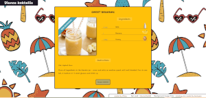

# 🪧 Cocktail of the day / Dienos kokteilis (lt)

## 📋 About

2022-03-06 friday assignment
Fetch and use data from external API - [thecocktaildb](https://www.thecocktaildb.com/api.php)

🌐 **Site published at**: [https://codevivi.github.io/using-api-cocktails](https://codevivi.github.io/cocktail-of-the-day)

🎯 **Goals:**

- Get and show one random cocktail information: picture, name, glass type, alcoholic or not, ingredients and measurement units.
- Under the cocktail info create button to get info about new cocktail - "Naujas kokteilis"
